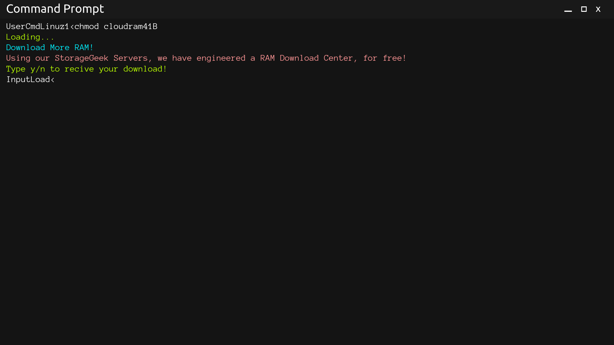

# Download more RAM! 
RAM (Random Access Memory) is a small drive that gets randomly used in computer applicatons to load data, for example "Chromium Tabs".
At one point, your RAM may get full. At that time, you can use our RAM Download commands to get more RAM to keep your computer working.

<h1>How to Activate</h1>
1.Download the package

2.Open the CMD

3.Run the command <code>chmod cloudram41B</code>. The system would have operated our code log system

4.
